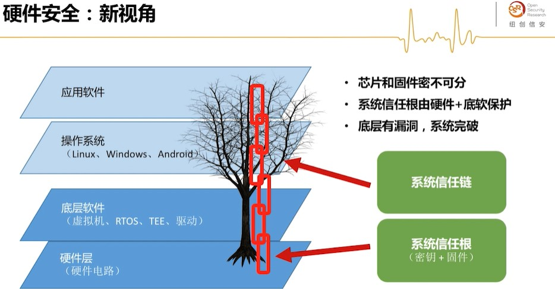
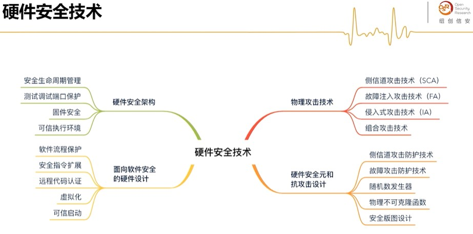

# course1 硬件安全综述

The quieter you become, the more you are able to hear.

不自律的人生，就是被人生反复的羞辱。
但你一件事每天都去做，坚持十年，必定会成为这件事的行家。

The limits of your language are the limits of your world.

# 硬件安全是什么

传统视角："硬件安全 = 密码芯片安全"，特别是智能卡、可信计算、Ukey等芯片的攻防技术
    密码芯片的逻辑接口、物理接口安全
    核心功能：具备防攻击能力，能有效保护密钥存储、进行安全密钥运算

# 智联时代

万物互联 + 智能化：端云协作、数字孪生、海量数据
    智能家居、智慧城市、电力网络等迈向智能时代
网络攻击进入物理世界：攻击截面扩大，风险巨大
    黑客操控物理世界产品，威胁从“谋财”升级为“害命”

