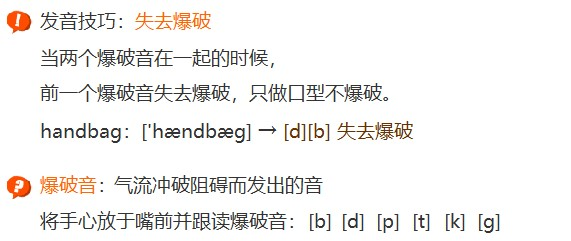

Vocabulary(词汇)：课文中出现单词及其常见用法的讲解以及语音知识的补充
v.----------->verb：动词
excuse   v.原谅
    excuse me:不好意思打扰了
    sorry:对不起，抱歉

excuse me和sorry的区别
    excuse me:希望引起对方注意，比如：问路，插话，走开，表示异议
        e.g. Excuse me, where is the nearest post office? 
            不好意思打扰一下，最近的邮局在哪里？
        e.g. ---> 举例                post office: 邮局

        e.g. Excuse me, I need to answer the call.
             不好意思，我接个电话。
    
    sorry: 常常用在表达已经做过的，或者发生过的事情上，比如：自己犯了某种过错，表达歉意
        e.g. Sorry, I'm late. May I come in?
             老师，对不起，我迟到了，能进来吗？
    sorry: 表达遗憾，比如听到了别人的不幸消息，表达同情，遗憾或者是由于不能满足别人的要求而感到抱歉
        e.g. A: My brother passed away.     我的兄弟去世了。
             B: Sorry to hear that.         听到这个消息我也很难过

        I'm sorry (to hear that).           我也很难过。

    总结：
        sorry 常用在发生过的事情
        excuse 常用在引起别人注意的场合

yes    adv.是，是的
    adv. ---> adverb: 副词
    e.g. Yes, sir. 是，长官。
         sir: n. 先生，长官
no     adv.不是，不是的

handbag      n.女用手提包
    hand     n.手
    bag      n.包

Glad to meet you.
很高兴认识你

glad 
    adj.高兴的
    