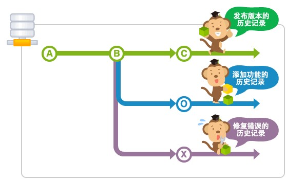

# Git 中branch

## 页面跳转

[返回网站首页](https://ryancatalina.github.io/)

[返回git 主页](/index.md)

## branch 介绍

分支是为了将修改记录的整体流程分叉保存，分叉后的分支不受其他分支的影响，所以在同一数据库里可以同时进行多个修改。
分叉的分支可以合并。

## Merge 分支

Merge分支是为了可以随时发布release而创建的分支，它还能作为Topic分支的源分支使用。保持分支稳定的状态是很重要的。如果要进行更改，通常先创建Topic分支，而针对该分支，可以使用Jenkins之类的CI工具进行自动化编译以及测试。

通常，大家会将master分支当作Merge分支使用。

## Topic 分支

Topic分支是为了开发新功能或修复Bug等任务而建立的分支。若要同时进行多个的任务，请创建多个的Topic分支。

Topic分支是从稳定的Merge分支创建的。完成作业后，要把Topic分支合并回Merge分支。

