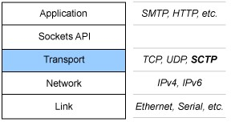

# RFC
## 概述

Request For Comments（RFC），是一系列以编号排定的文件。文件收集了有关互联网相关信息，以及UNIX和互联网社区的软件文件。RFC文件是由Internet Society（ISOC）赞助发行。基本的互联网通信协议都有在RFC文件内详细说明。RFC文件还额外加入许多在标准内的论题，例如对于互联网新开发的协议及发展中所有的记录。因此几乎所有的互联网标准都有收录在RFC文件之中。

## 注意事项

1、一是需要确定它是最新的文档，二是需要注意RFC文档的类别；

2、所有的RFC文档都要经历评论和反馈过程，并且在这一段时间内它们会被划分为不同的类别；

3、RFC文档一旦被提交，IETF和IAB组织将审查RFC文档，通过后可以成为一项标准；

4、RFC文档按照它发展与成熟的过程可以分为标准、草案标准、提案标准、实验性的、信息性或历史性的；

5、RFC文档又可以分为被要求、被推荐、被选择、受限制使用或不被推荐。

# SCTP 通信协议简介

## SCTP 协议所在的IP 栈中的位置

## SCTP 协议简介

SCTP 是一个传输协议，和UDP、TCP类似
 
* TCP是一种面向连接地协议，提供可靠传输，确保数据有序发送

* UDP是一种面向消息的协议，不能确保数据有序发送

SCTP 是后来引入的一种新的协议，提供了和TCP一样的可靠、有序的数据传输功能，同时却能和UDP 一样面对消息的方式来进行操作，保护消息边界，有下面一些特性:

* 多宿主（Multi-Homing）

* 多流（Multi-streaming）

* 初始化保护（Initiation protection）

* 消息分帧（Message framing）

* 可配置的无序发送（Configurable unordered delivery）

* 平滑关闭（Graceful shutdown）

## SCTP 应用链接

https://www.ibm.com/developerworks/linux/library/l-sctp/?S_TACT=105AGX52