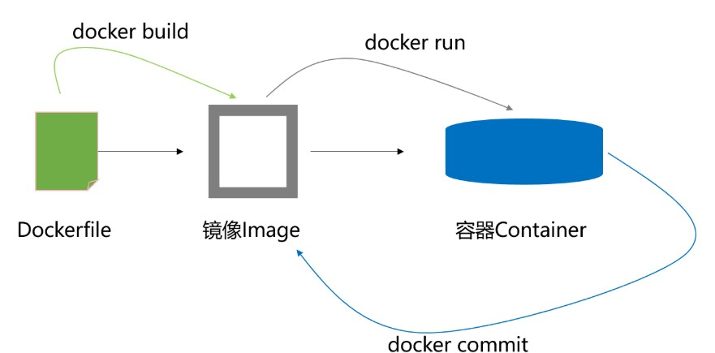
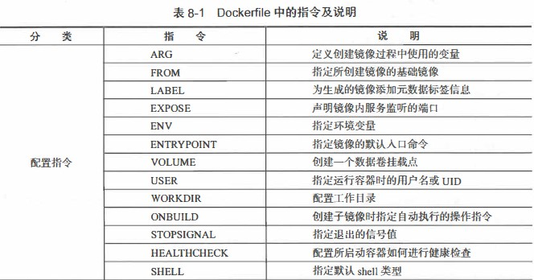
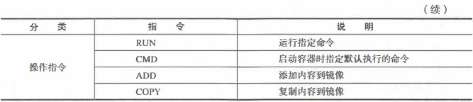
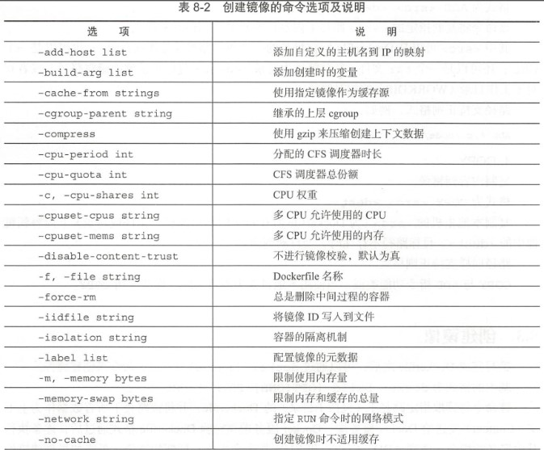
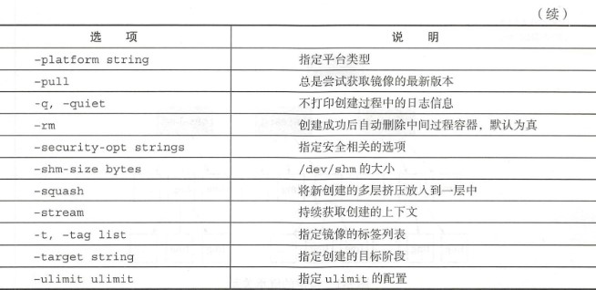
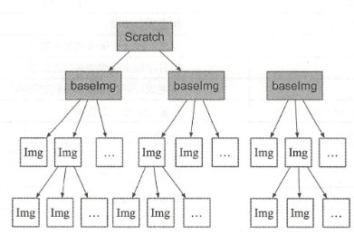

# 创建docker 镜像的两种方式



# 使用Dockerfile 的方式创建镜像

Dockerfile 是一个文本格式配置的文件。

Dockerfile 由一行行命令语句组成，并且支持以# 开头的注释行。

Dockerfile 主体内容分为四部分：

* 基础镜像信息
* 维护者信息
* 镜像操作指令
* 容器启动时执行指令

## 基本结构

首行可以通过注释来指定解析器命令，后续通过注释说明镜像的相关信息。

```
# escape=\ (backslash)
```

主体部分首先使用FROM 指令指明所基于的镜像名称。

```
#  Base image to  use, this must be  set  as  the  first line 
FROM ubuntu:xeniel
```

接下来一般是使用label 指令说明维护者信息。

```
# Maintainer: docker_user <docker_user at email.com> (@docker_user)  
LABEL maintainer docker user<docker user@email.com> 
```

后面则是镜像操作命令，RUN 指令将对镜像执行跟随的命令，每运行一条RUN 指令，镜像添加新的一层，并提交。

```
# Commands to  update the  image 
RUN echo "deb http://archive.ubuntu.com/ubuntu/ xeniel main universe" >> /etc/apt/sources.list
RUN apt-get update && apt-get install -y nginx
RUN echo "\ndaemon off;" >> /etc/nginx/nginx.conf
```

最后是CMD 指令，指定运行容器时的操作命令。

```
# Commands when creating a new container
CMD /usr/sbin/nginx
```

拓展：EXPOSE 指令为镜像暴露的端口

```
EXPOSE 80 443
```

## Dockerfile 指令说明参考表




## 操作指令

RUN、CMD、ADD、COPY

## 创建镜像

编写完Dockerfile 之后，可以通过docker [image] build 命令来创建镜像。
命令格式：docker build [OPTION] PATH | URL | -

### docker [image] build命令选项及说明





### 选择父镜像

大部分情况下，生成新的镜像都需要通过FROM 指令来指定父镜像。父镜像是生成镜像的基础，会直接影响到所生成镜像的大小和功能。

用户可以选择两种镜像作为父镜像，一种是所谓的基础镜像（baseimage），另外一种是普通的镜像（往往由第三方创建，基于基础镜像）。

基础镜像比较特殊，其Dockerfile 中往往不存在FROM 指令，或者基于scratch 镜像（FROM scratch），这意味着其在整个镜像树中处于根的位置。

普通镜像也可以作为父镜像来使用，包括常见的busybox、debian、Ubuntu 等。

docker 不同类型镜像之间的继承关系如图：

### 多步骤创建

自17.05 版本开始，Docker 支持多步骤镜像创建（Multi-stage build）特性，可以精简最终生成的镜像大小。

对于需要编译的应用（如C、Go 或Java 语言等）来说，通常情况下至少需要准备两个环境的docker 镜像：

* 编译环境镜像：包括完整的编译引擎、依赖库等，往往比较庞大。作用是编译应用为二进制文件。
* 运行环境镜像：利用编译好的二进制文件，运行应用，由于不需要编译环境，体积比较小。

使用多步骤创建，可以在保证最终生成的运行环境镜像保持精简的情况下，使用单一的Dockerfile，降低维护的复杂度。
## docker 技术最佳实践

* 精简镜像用途
* 选用合适的基础镜像
* 提供注释和维护者信息
* 正确使用版本号
* 减少镜像层数
* 恰当使用多步骤创建
* 使用 .dockerignore文件：使用它可以标记在执行docker build时忽略的路径和文件，避免发送不必要的数据内容，从而加快整个镜像创建过程。
* 及时删除临时文件和缓存文件
* 提高生成速度
* 调整合理的指令顺序
* 减少外部源的干扰

